## Academic Discussion Forum and Messaging

### Table of Contents
**[Tech Stack](#Techstack)**<br>
**[Execution](#Execution)**<br>
**[Demo Features](#Features)**<br>
**[Security Considerations](#SecurityConsiderations)**<br>
**[References](#References)**<br>

### Techstack

  | Frontend   | Backend                 | Database  |
  | :--------  | :-----------------------| :--------------------- | 
  | Jinja + Bootstrap 5   | Flask (Python) | SQLite               |
  | JS + JQuery + Axios   | Flask-SocketIO | SQLAlchemy      |

### Execution

* Dependencies Installation
  
  ```
    pip install -r requirements.txt
  ```

* Setup HTTPS - Trust CA: under `/certs`

  ```
    (MAC only) cd certs/
  ```
    
  ```
     sudo security add-trusted-cert -d -r trustRoot -k "/Library/Keychains/System.keychain" CA.pem
  ```

* Run program

  ```
    make
  ```

  * Default Admin Account:  (`X`, `pwd`)
 
* If the web stuck or crash: `flush socket pools`

  ```
    chrome://net-internals/#sockets
  ```

### Features
  
  ```
    Realtime update: RT
  ```

* #### Navbar

  * Table of contents 

    | Nav    |  Goto |                             
    | :--------  | :-----------------------------------| 
    | `Signup` | [Jump](#Signup/Login) |
    | `Login` | [Jump](#Signup/Login) | 
    | `Chat` | [Jump](#Chat) |          
    | `Repo` | [Jump](#Repo) &nbsp;&nbsp;&nbsp;&nbsp;&nbsp;&nbsp;&nbsp;&nbsp;&nbsp;&nbsp;&nbsp;&nbsp;&nbsp;&nbsp;&nbsp;&nbsp;&nbsp;&nbsp;&nbsp;&nbsp;&nbsp;&nbsp;&nbsp;&nbsp;&nbsp;&nbsp;&nbsp;&nbsp;|

    <p>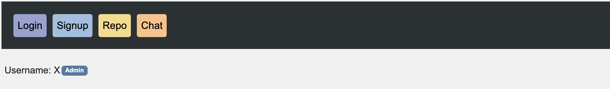</p>

* #### Signup/Login:

  * New accounts has `Student` role by default.
 
  * This project is essentially about a discussion forum & private chat.

  * The reason for it being an "Academic Discussion Forum" is related to accounts role.

  * All roles (permissions) from lowest to highest are `Student`, `Academics`, `Administrative`, `Admin`.


* #### Chat

  * Chat Window (with emoji textarea) and Toolbar 
  
    | Tab    | RT   | Encrypted | Usage |                             
    | :--------  | :--- | :-------- | :-----------------------------------| 
    | `Friends`  | ✅   | ✅        | p2p chat, friendlist, online status |
    | `Group`    | ✅   | 🅾️        | group chat                          |
    | `Sent`     | ✅   | 🅾️        | all sent friend requests            |
    | `Received` | ✅   | 🅾️        | all received friend requests        |
    | `[icon]`   | ✅   | 🅾️        | tooltab for add/unfriend, create groupchat &nbsp;&nbsp;&nbsp;&nbsp;&nbsp;&nbsp;&nbsp;&nbsp;&nbsp;&nbsp;&nbsp;&nbsp;&nbsp;&nbsp;&nbsp;&nbsp;&nbsp;&nbsp;&nbsp;&nbsp;&nbsp;&nbsp;&nbsp;&nbsp;&nbsp;&nbsp;&nbsp;&nbsp;&nbsp;&nbsp;&nbsp;&nbsp;&nbsp;|
    | `Chat Window` | ✅   | ✅        | chat + emoji textarea       |

  * `Toolbar`
     <p>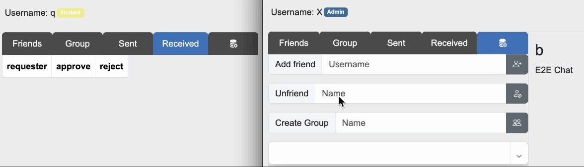</p>
 
     <p>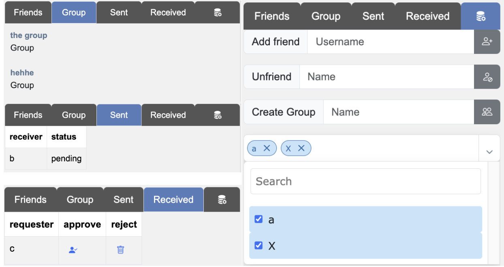</p>

   * `Chat Window`
 
     * **Server message**: Yellow

     * **Sent message**: Blue

     * **Received message**: Orange   

     <p>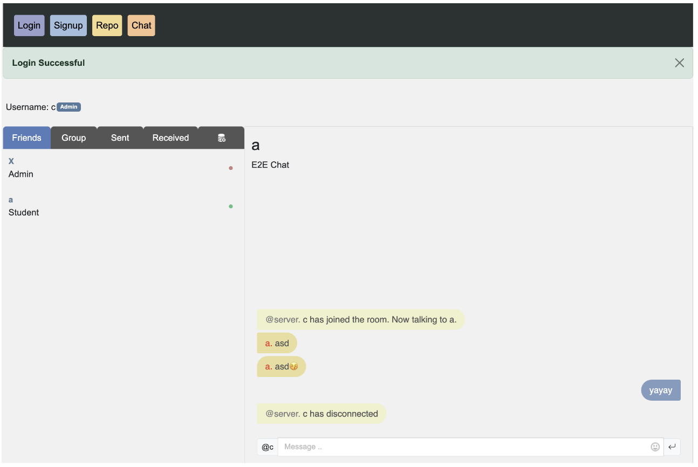</p>

  * `Emojitextarea` 
     
     <p></p>

  <br>

* #### Repo

  * Discussion Forum

    | Tab        | RT    | Usage |                             
    | :--------  | :--- | :-----------------------------------| 
    | `General Setting`  | ✅  | list all accounts, promote/demote, create repo/add member |
    | `Repo Article`    | ✅ | post (crud), comment (crud)                        |
    | `Repo Chat`     | ✅ | chat     |
    | `Repo Setting` | ✅  | list repo members, kick/add/unmute/mute member, seaarch filter &nbsp;&nbsp;&nbsp;&nbsp;&nbsp;&nbsp;&nbsp;&nbsp;&nbsp;&nbsp;&nbsp;|

  * `Repo Article`

    * User roles are displayed in every comment and post.
      
    * All members of repo can make, delete and modify their own articles.
    
    * Staff (role `Academics` or higher) is able to delete and modify other people's
articles regardless of role.

    * All members of repo can make, delete their own comments.

    * Staff (role `Academics` or higher) can delete other people’s comments
regardless of role.
 
    <p>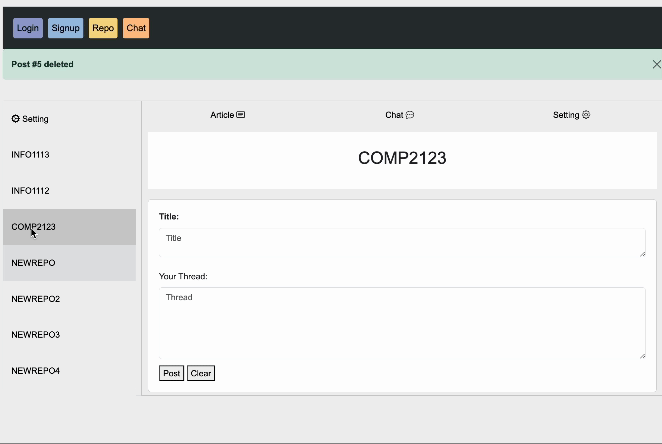</p>
 
  * `Repo Chat Room`

    <p>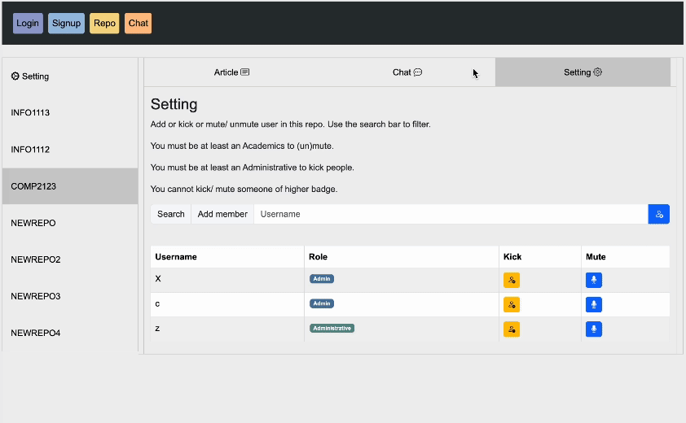</p>
 
  * `Repo Setting`
 
    * Kick/ add people to this repo (`Administrative`)

    * (Un)mute people in this repo (`Academics`)
   
    * `Admin` have all rights but this is targeting `Academics` & `Administrative` to operate
on a specific repo.

    * All roles have all rights of lower level roles.
   
    * Search filter for easy user managements in a repo.
   
    <p>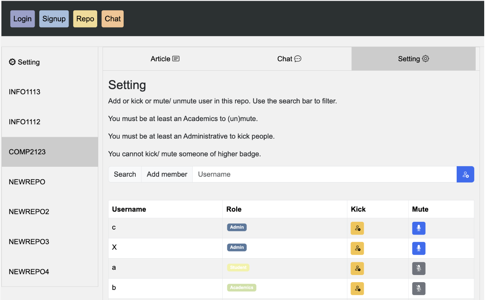</p>

    * If a user is muted in a specific repo, all text areas and inputs within the repo
are blocked.

    * They can’t comment or post or chat. But they can still see new
posts, new comments and new incoming messages.

    <p>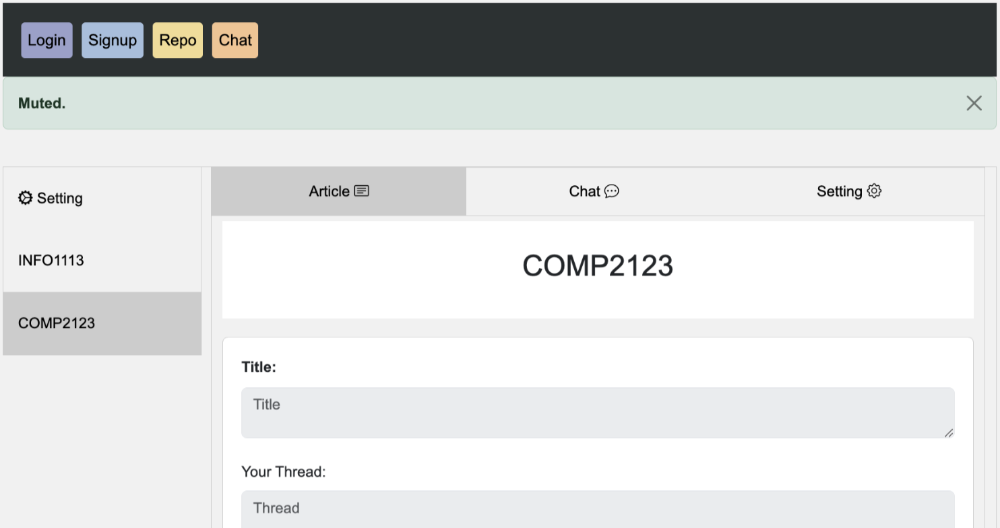</p>
 
  * `General Setting`

    * Functions focus on `Admin` and `Administrative`

    * Promote/ demote/ create repo (Admin)
    
    * Select multiple people to add to existing repo (`Admin` and `Administrative`)
   
    * Show all accounts in the system with a search filter. New sign-up accounts will be
shown in real time in this table.

    * When creating a new repo, all added users will receive a notification to refresh the
webpage to see the new repo.

    <p>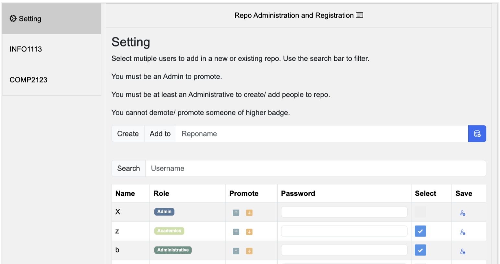</p>
    
    <p>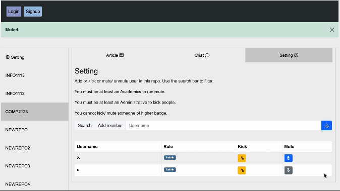</p>

    <p>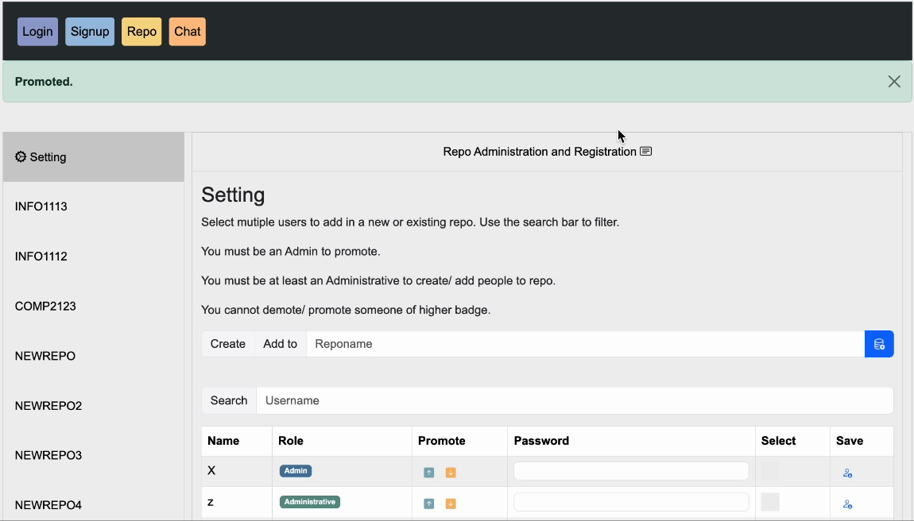</p>

### SecurityConsiderations

  | Criteria   | Implementation via   |
  | :--------  |  :--------------------- | 
  | Connection   | HTTPS TLS 1.3 | SQLite               |
  | Request Authentication | JWT, Flask Cookie      |
  | Password Hashing | Double hashing in client-side (cryptojs) and server-side (brcypt) |
  | Message Confidentiality & Integrity (communication) | RSA for exchanging symmetric secret key for message encryption + HMAC |
  | Encrypted Message History (storage) | (only p2p) store encrypted history & shared log key to decrypt history |
  |  |  shared log key encrypted by user pbkdf2 before storing on server |

### References

bootstrap35 https://www.w3schools.com/bootstrap/default.asp https://www.w3schools.com/bootstrap5/index.php 

css https://www.w3schools.com/howto/default.asp https://stackoverflow.com/questions/20565201/how-to-make-the-long-text-to-fit-inside-a-small-div/20565223#20565223 https://medium.com/@AppCode/15-css-chat-box-examples-and-code-ce47c84fba8e https://stackoverflow.com/questions/59100312/single-button-to-show-hide-element-with-pure-css/59101059#59101059 https://stackoverflow.com/questions/9707397/making-a-div-vertically-scrollable-using-css/9707458#9707458 https://stackoverflow.com/questions/6089245/put-a-green-dot-or-red-dot-to-show-user-is-online-or-not/6089317#6089317 https://stackoverflow.com/questions/71154905/css-for-chat-room-speech-bubble-position/71155285#71155285 https://stackoverflow.com/questions/14854900/how-to-move-text-up-using-css-when-nothing-is-working/14855215#14855215

html & jquery https://github.com/habibmhamadi/multi-select-tag https://stackoverflow.com/questions/7522848/contenteditable-false-inside-contenteditable-true-block-is-still-editable-in-ie8/9615471#9615471 https://stackoverflow.com/questions/66529344/how-do-i-make-an-editable-paragraph-in-html/66529390#66529390 https://stackoverflow.com/questions/55206075/change-css-class-content-with-jquery/55206179#55206179 https://stackoverflow.com/questions/3145431/how-to-remove-table-row-based-on-contents-of-one-of-the-cells-in-the-row-with-j/3145455#3145455 https://stackoverflow.com/questions/42765042/jquery-increment-the-id-and-href-of-elements/42765106#42765106 https://stackoverflow.com/a/376116 https://stackoverflow.com/a/14939132 https://stackoverflow.com/a/67154151 https://stackoverflow.com/a/1057428 https://stackoverflow.com/a/59970022 https://stackoverflow.com/a/33875710 https://stackoverflow.com/a/734053 https://stackoverflow.com/a/45759349 https://stackoverflow.com/a/25205496 https://stackoverflow.com/a/8249801 https://stackoverflow.com/a/38494302 https://stackoverflow.com/a/11619604 https://stackoverflow.com/questions/22024802/jquery-how-to-get-value-of-selected-option-in-a-table-row/22024831#22024831

icon & emojitextarea https://stackoverflow.com/questions/59462663/clear-the-form-textarea-after-submit-emoji-picker-with-jquery/59462774#59462774 https://icons.getbootstrap.com/ https://stackoverflow.com/questions/59437471/emojione-area-defined-textarea-didnt-except-any-overwritten-css-fix

socketio https://stackoverflow.com/questions/66610562/socketio-to-emit-to-a-particular-user-without-using-separate-room-for-every-cli https://flask-socketio.readthedocs.io/en/latest/getting_started.html https://www.squash.io/implementing-real-time-features-with-flask-socketio-and-websockets/ https://stackoverflow.com/questions/29266594/broadcast-to-all-connected-clients-except-sender-with-python-flask-socketio

jwt & flask cookie https://www.opensourceforu.com/2022/10/implementing-jwt-using-the-flask-framework/ https://verdantfox.com/blog/cookies-with-the-flask-web-framework https://stackoverflow.com/questions/73436354/flask-and-httponly-cookie

https https://deliciousbrains.com/ssl-certificate-authority-for-local-https-development/ https://lazypro.medium.com/socket-io-with-tls-f5a936a1976b

sqlalchemy https://stackoverflow.com/questions/65271004/primary-key-that-is-unique-over-2-columns-in-sqlalchemy https://stackoverflow.com/questions/9706059/setting-a-default-value-in-sqlalchemy https://www.freecodecamp.org/news/python-get-current-time/ https://stackoverflow.com/questions/17665809/remove-key-from-dictionary-in-python-returning-new-dictionary https://dsbowen.github.io/sqlalchemy-mutable/mutable_dict/ https://stackoverflow.com/questions/52900981/how-to-make-sqlalchemy-store-an-object-as-json-instead-of-a-relationship https://docs.sqlalchemy.org/en/20/orm/session_basics.html#deleting https://docs.sqlalchemy.org/en/20/orm/session_api.html#sqlalchemy.orm.Session.get https://www.tutorialspoint.com/sqlalchemy/sqlalchemy_orm_updating_objects.htm https://www.tutorialspoint.com/sqlalchemy/sqlalchemy_orm_using_query.htm https://stackoverflow.com/questions/17717877/convert-sqlalchemy-query-result-to-a-list-of-dicts https://soumendrak.medium.com/autoincrement-id-support-in-sqlalchemy-6a1383520ce3

aes pbkdf2 hmac sha256 cryptojs https://dev.to/halan/4-ways-of-symmetric-cryptography-and-javascript-how-to-aes-with-javascript-3o1b https://cryptojs.gitbook.io/docs/ https://medium.com/@adarsh-d/aes-encryption-and-decryption-in-javascript-using-cryptojs-81b57205711d https://stackoverflow.com/q/75446363 https://coolaj86.com/articles/symmetric-cryptography-aes-with-webcrypto-and-node-js/ https://medium.com/@araj60988/title-secure-data-encryption-and-decryption-with-cryptojs-in-javascript-2833d5d35068 https://stackoverflow.com/a/71217694 https://rahulbhilesha077.medium.com/encrypmon-decrypmon-using-rsa-in-java-script-cb7b3a6b3eee github.com/juhoen/hybrid-crypto-js

js https://blog.logrocket.com/understanding-axios-get-requests/ https://www.freecodecamp.org/news/web-storage-localstorage-vs-sessionstorage-in-javascript/

bcrypt https://stackoverflow.com/a/27519440 https://stackoverflow.com/a/70938979

db tool https://dbdiagram.io/ https://sqlitebrowser.org/dl/

      
